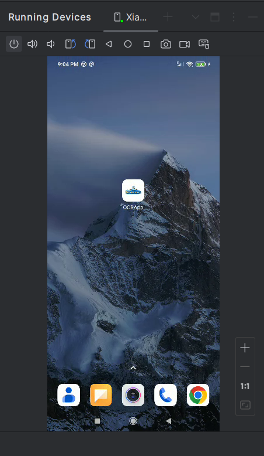
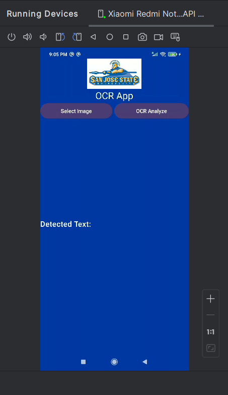
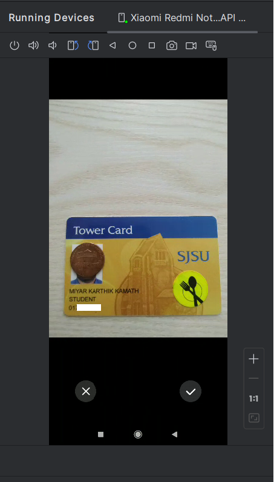
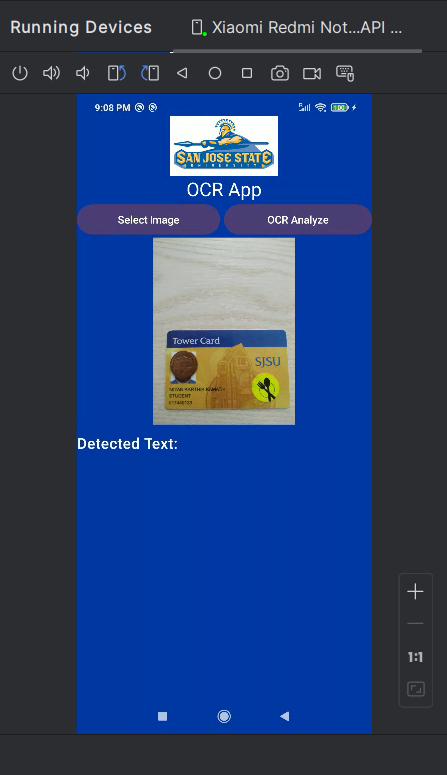
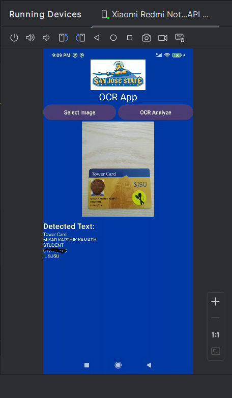

# CMPE277-OCR-App
Purpose of the assignment is to integrate Machine Learning and AI as part of the Web UI. 

*	University Name: http://www.sjsu.edu/
*	Course: CMPE 277 - Smartphone App Dev
*	Professor: [ChandraSekar Vuppalapati](https://www.linkedin.com/in/chandrasekarvuppalapati/)

### Screenshots

Home Screen: Launching OCRApp:

Main Screen:

Uploading image:

Image clicked gets shown in the app:

On clicking “OCR Analyze” button, it detects the text in an image using MLKIT:

